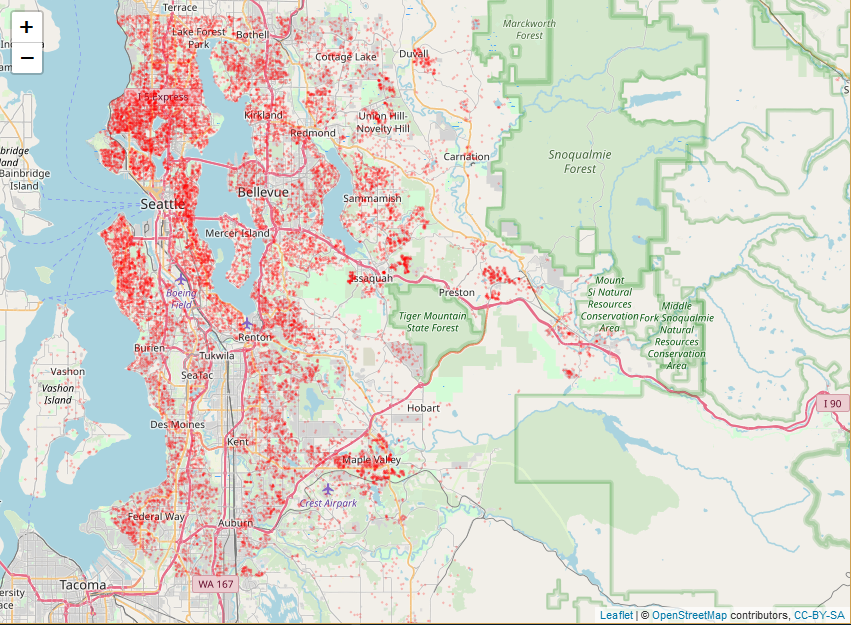

```{r setup, include=FALSE}
set.seed(1234)
#install.packages("kableExtra")
#install.packages("jpeg")
#install.packages("png")
#install.packages("kable")
#install.packages("gridExtra")
#install.packages("bestNormalize")
#install.packages("doParallel")
#install.packages("parallel")
library(lubridate)
library(gridExtra)
library(MASS)
library(png)
library(jpeg)
library(tidyverse)
library(knitr)
library(car)
library(faraway)
library(broom)
library(bestNormalize)
library(doParallel)
library(parallel)
#update.packages("kableExtra")
knitr::opts_chunk$set(cache=TRUE, warning=FALSE)
#library(kableExtra)
#options("kableExtra.html.bsTable" = T)
options(scipen=999)
#options(kableExtra.latex.load_packages = FALSE)

cl <- makeCluster(detectCores())
registerDoParallel(cl)

raw_data <- readRDS("raw_data.rds")
full_data <- readRDS("full_data.rds")
full_data_woo <- readRDS("full_data_woo.rds")

B <- 100
k <- 10
```

## The goal

Our aim in this project is the construction and refinement of a predictive model which predicts with the highest accuracy possible the price of future house sales in King County, USA, which may be applicable to other countys as well.

## The dataset

The data consists of house sale prices for King County area, Washington State, which includes Seattle. It contains houses sold between May 2014 and May 2015. The dataset was obtained from https://www.kaggle.com/harlfoxem/housesalesprediction on December 2018 and consists of `r nrow(raw_data)` observations in `r ncol(raw_data)` variables. The following map displays the geographical distribution of the data points. We can observe that most of the data points being spread around most of the urban areas with smaller amounts in the rural areas.
\hfill\break

```{r echo = FALSE, fig.align="center", out.width="450px"}

```

## Variables

Below is a description of each one of the variables avaliable in the data:

* id: Unique ID for each home sold
* date: Date of the home sale 
* price: Price of each home sold 
* bedrooms: Number of bedrooms 
* bathrooms: Number of bathrooms, where .5 accounts for a room with a toilet but no shower 
* sqft_living: Square footage of the apartments interior living space 
* sqft_lot: Square footage of the land space 
* floors: Number of floors 
* waterfront: A dummy variable for whether the apartment was overlooking the waterfront or not 
* view: An index from 0 to 4 of how good the view of the property was 
* condition: An index from 1 to 5 on the condition of the apartment, 
* grade: An index from 1 to 13, where 1-3 falls short of building construction and design, 7 has an average level of construction and design, and 11-13 have a high quality level of construction and design. 
* sqft_above: The square footage of the interior housing space that is above ground level 
* sqft_basement: The square footage of the interior housing space that is below ground level 
* yr_built: The year the house was initially built 
* yr_renovated: The year of the house’s last renovation 
* zipcode: What zipcode area the house is in 
* lat: Latitude 
* long: Longitude 
* sqft_living15: The square footage of interior housing living space for the nearest 15 neighbors 
* sqft_lot15: The square footage of the land lots of the nearest 15 neighbors 


## Response variable: numeric and visual inspection

Here we observe some descriptive statistics about the sale prices:
\hfill\break

```{r echo=FALSE}
Y_col = raw_data$price
tidy(summary(raw_data$price)) %>% 
  kable()
```

\hfill\break
By looking at the Median and Mean, we suspect right skeweness in the data. We verify this in the following visual inspection of the data:

```{r echo=FALSE, fig.align = "center", fig.width=10.3, fig.height=5.5}
par(mfrow = c(1,2))
truehist(raw_data$price,
         xlab = "price")
a <- qqPlot(raw_data$price,
            xlab = "quantiles",
            ylab = "")
```

Adittionally to confirming our suspicion of right skeweness, we observe in the qq-plot (the one on the right) that the distribution does not fit the theoretical quantiles of the normal distribution. This goes against the "utopian" assumption of normality for the response variable when attempting linear regression analysis. 

In order to improve this, we apply a simple transformation to the response variable. The data is transformed to it's coresponding logarithm with base 10. The following are the histogram and qq-plot of the transformed variable:

```{r echo=FALSE, fig.align = "center", fig.width=10.3, fig.height=5.5}
par(mfrow = c(1,2))
truehist(log10(raw_data$price),
         xlab = "price")
a <- qqPlot(log10(raw_data$price),
            xlab = "quantiles",
            ylab = "")
```

The transformation proves to be a huge improvement in terms of the normality assumption

## Regarding model selection

In order to pick the "best" model, a criteria must be specified. The P-value presents the problem of multiple testing, and, since we will be conducting several statistical tests, will only serve as a supporting criteria.

Given this, the following metrics will be used for model comparison instead:
 
* $AIC$
* $BIC$
* $RMSE$
* $T-Test$ $(P-value)$

### Testing procedure

The first model criteria we are considering are the AIC and the BIC. Those are defined as:

\begin{align*}
    AIC &= -2logL(\hat{\theta}) + 2p \ & \ BIC &= -2logL(\hat{\theta}) + log(n)p\\
\end{align*}

The AIC is a model selection method which punishes the amount of variables by adding two times the amount of variables to two times the negative log liklihood of $\hat{\theta}$, a lower value being the desired outcome. Considering our datasets great amount of observations (n = `r nrow(raw_data)`) the punishment might be negligible. A better criteria might therefore be the BIC which penalizes the amount of variables by  multiplying them with the log of the amount of observations. The BIC will therefore be our prefered metric of those two.

Our model being a predictive model the most important metric would still be the RMSE, the rooted mean square error, which is a measure of the mean prediction error:

\begin{align*}
    RMSE &= \left(\sum_{i = 1}^{N} \left(y_{pi} - y_{oi}\right)^{2} \right)^{\frac{1}{2}}
\end{align*}

with:

  * $y_{pi}$ being the $i$-th predicted response value
  * $y_{oi}$ being the $i$-th observed response value
  
This critria gives us an actual predictive performance measure to compare different models against each other in a meaningful an easy to interpret format, the amount of dollars for which a house was sold. To make this metric and its comparisons even more precise we will use two more different methods.

The first one will be a repeated cross-validation procedure using the k-fold strategy. For this method the data set will be randomly divided into $k$ different folds. Leaving one fold out a model will be fitted against the remaining folds. The model will then attempt to predict the values of the fold previously left out and the RMSE will be calculated. This procedure will be repeated for all the different folds. This whole procedure of calculating the RMSE for all $k$ folds will then again be repeated for $B$ times. In our case we will use $k = 10$ and $B = 100$.

Using all those repeated measurements of the RMSE as a sample distribution we are now able to use the second method of comparison, a one sided two means t-test of the two RMSE distribution of two different model. This gives us a measure of confidence, a p-value, about the difference between those models.
  
## Preliminary data formating

It was necesary to do some initial formating in order to make sense of the data for a linear model, and to add value for the model. The modifications are the following:

  - transforming square feet into square meters
  - converting waterfront, renovated and zipcode into a factor variable
  - splitting date into week and month of the year, removing original date variable
  - removed id because it is not informative
  - split dataset into two parts, 80% and 20% (more on this later)
\hfill\break
```{r message=FALSE, warning=FALSE}
complete_data <- read_csv("kc_house_data.csv") %>%
  sample_n(nrow(.))

raw_data <- complete_data %>%
  slice((n()/5):n())

data_20p <- complete_data %>%
  slice(1:(n()/5))

full_data <- raw_data %>%
  mutate_at(
    vars(starts_with("sqft")),
    function(x) x * 0.092903
  ) %>%
  rename_at(
    vars(starts_with("sqft")),
    function(x) str_replace(x, "sqft", "sqm")
  ) %>%
  mutate(
    week_of_year = week(date),
    month_of_year = month(date),
    renovated = factor(ifelse(yr_renovated > 0, "yes", "no")),
    wasViewed = factor(ifelse(view > 0, 1, 0)),
    waterfront = factor(waterfront)
  ) %>%
  select(-id, -date, -starts_with("sqm"), starts_with("sqm"))


first_fifth_avg <- data_20p %>%
  group_by(zipcode) %>%
  summarise(mean_price_zip = mean(price))

full_data <- full_data %>%
  left_join(., first_fifth_avg, key = zipcode) %>%
  mutate(
    price = log10(price),
    mean_price_zip = log10(mean_price_zip)
  )
```

## The first model

In the first model only the useful original variables will be included with minimal formating to provide a baseline for comparison.

```{r}
data_wo_new_vars <- full_data %>%
  select(-wasViewed, -renovated, -mean_price_zip)

model_1 <- lm(price ~ ., data = data_wo_new_vars)
summary(model_1)
```

There are two peculiarities we can observe. In the first place, we observe that the variable sqm_basement was not taken into account and consists solely of NAs. The second observation provides the reason for this behavior: "A singularity was discovered". That means that sqm_basement is a linear combination of two or more other variables, sqm_living and sqm_above in this case. The decision to remove those variables will be dealt with during the experimentation phase.

## Experimentation

Given that we now have both a baseline model and have defined a model selection criteria, using a trial and error approach, we can start testing different approaches seeking to improve the model. Among those approaches we will attempt outlier detection, creation of new, meaningful variables, correlation analysis and different kinds of variable transformations. Let us start with outlier detection.

### Outliers

Outliers, depending on their impact, may have a detrimental effect on the capacity of a model to effectively fit itself to the general patterns of the data and not just the present sample, which decreases its predictive ability. To find those divergent data points we will have a look at their leverage and the cook's distance.

* **Leverage**: The power to shift the model towards that specific data point
* **Cook's distance**: Measures the aggregated influence of that observation on the fitted values

```{r}
par(mfrow = c(1,2))
plot(model_1, which=5)
plot(model_1, which=4)
```

Inspecting the cooks distance plot we find that there are 4 highly influential data points. For the following test we will fit a linear model without these aforementioned observations and compare it to our baseline model.

```{r}
cross_val <- function(data, B = 100, k = 10){
  n <- nrow(data)
  folds <- sample(rep(c(1:k), length.out = nrow(data)))
  results <- foreach(icount(B), .combine = cbind) %dopar% {
    res <- numeric(k)
    for (i in 1:k) {
      training <- data[folds != i,]
      test <- data[folds == i,]

      lmo <- lm(data = training, price ~ .)
      predict <- predict(lmo, test)
    
      res[i] <- sum((10^test$price - 10^predict)^2)/length(test$price)
    }
    res
  }
  m_rmse <- mean(sqrt(results))
  sd_rmse <- sd(sqrt(results))
  l <- list(distr = sqrt(results), m_rmse = m_rmse, sd_rmse = sd_rmse)
  return(l)
}

intermediate_1 <- full_data_woo %>%
  select(-wasViewed, -renovated, -mean_price_zip)

intermediate_2 <- data_wo_new_vars

model_2 <- intermediate_1 %>%
  lm(data = . , price ~ .)

cv_2 <- cross_val(intermediate_1)
cv_1 <- cross_val(intermediate_2)

p_value_1 <- tidy(t.test(cv_1$distr, cv_2$distr, var.equal = F, alternative = "greater")) %>% 
  select(p.value) %>% 
  unlist() %>% 
  formatC(format = "e") %>% 
  rbind(" ",.)

Mean_RMSE <- round(rbind(cv_1$m_rmse, cv_2$m_rmse), 0)
SD_RMSE <- round(rbind(cv_1$sd_rmse, cv_2$sd_rmse), 0)

cbind(BIC(model_1, model_2), Mean_RMSE, SD_RMSE, p_value_1) %>%
  kable()
```

Out of the resulting summary table, we can draw some conclusions regarding the removal of these outliers:

* By solely looking at the three first metrics (AIC, mean of RMSE and s.d. of RMSE) we can see that removal of outliers proves itself succesful.
* When looking only at theMean RMSE, we observe it was reduced by almost 25.000$. This, in terms of usefulness as a prediction tool in real life scenarios, is very desirable, given that it provides the end user with a more accurate estimation o the actual values.
* The standard deviation of RMSErrors was cutted almost by half, meaning that the new models are way more stable.
* In the last metric of the table, the P-value, we can verify the significance of the conclutions made above. Since the resulting number is very low (highly significant), we proceed to conclude with confidence (>99%) that the previous statements are valid.
* The AIC was reduced by 83.

In terms of data points (observations) there will be no further additions or removals from now on. So, the next phases of experimentation, are rather column-wise, and focus on the creation, deletion or edition of the variables as a whole.

### Creating new variables

In this phase, we decided to create some additional variables by using "hidden" data in the current ones, or by creating a simplified version of an existing one.


#### 1. Average price by zipcode: 

To understand the creation process of this variable and why it is a valid thing to do, it is necessary to explain the 80%-20% data splitting mentioned before in the _Preliminary data formating_ section. 

It goes as follows: Since the splitting of the data, which is made at the very beggining, we have only worked with the 80% chunk, which comes to represent the only "visible data" for our experiments, model comparison, conclusion making and everything else. Given this, we could see the rest of the 20% data as "preconcieved", by this, we intend to pretend as if the information (including the sale prices) provided by this set of observations is available thoughout all the study, while not being considered data leakage since the rows themselves are not being used to train or evaluate any model at any point. 

So, how are we using this data exactly? The answer is: as a summary of prices by zipcode. First we select the zipcode and the price columns in this 20% chunk, then we group the observations by their zipcode and compute the average price within each zipcode, finally in the 80% data chunk, we create a new column containing the average price found in the corresponding zipcode-price pairs obtained with the 20% chunk. In this way, we have obtained additional data to the model, which is related to the prices, without incurring into data leakage.


```{r warning=FALSE}
intermediate_3 <- full_data_woo %>% 
  select(-wasViewed, -renovated)

model_3 <- lm(price ~ ., data = intermediate_3)

cv_3 <- cross_val(intermediate_3)

p_value_2 <- tidy(t.test(cv_2$distr, cv_3$distr, var.equal = F, alternative = "greater")) %>% 
  select(p.value) %>% 
  unlist() %>% 
  formatC(format = "e")

Mean_RMSE <- round(rbind(cv_2$m_rmse, cv_3$m_rmse))
SD_RMSE <- round(rbind(cv_2$sd_rmse, cv_3$sd_rmse))
p_vals <- rbind(" ", p_value_2)

cbind(BIC(model_2, model_3), Mean_RMSE, SD_RMSE, p_vals) %>%
  kable()
```

Once again, let us analyze the results summary:

* In terms of our comparison criteria, introducing this new variables improves the model.
* The Mean RMSE is reduced by about 30.000$
* The standard deviation of RMSEs remains similar to the previous one. So adding this variable does not destabilizes the model cosiderably.
* Once Again, the P-value obtained suggests that the difference in the distribution of RMSEs is highly significant when using this additional variable.
* Considerably large improvement in the BIC metric.


#### 2. Factorize:

The second and third additional columns, are less complicated, being only a simplification of two current columns. The general reasoning is, rather than using all the values provided in the column, we are only concerned on whether or not there is a non-zero value present. The specific transformations are:

* From the _view_ variable, create a "yes or no" variable indicating if the properties has been viewed or not.
* From the _year renovated_ variable, create a variables that specifies if the property has ever been renovated or not.

For the following experiment (model 3), we will test if adding the transformed variables will improve the model as well as whether we should keep the untransformed original ones on which the new ones are based or not.

```{r}
intermediate_3.1 <- full_data_woo
model_3.1 <- lm(price ~ ., data = intermediate_3.1)

cv_3.1 <- cross_val(intermediate_3.1)

p_value_2.1 <- tidy(t.test(cv_3$distr, cv_3.1$distr, var.equal = F, alternative = "greater")) %>% 
  select(p.value) %>% 
  unlist() %>% 
  formatC(format = "e")

intermediate_3.2 <- full_data_woo %>% 
  select(-view, -yr_renovated)

model_3.2 <- lm(price ~ ., data = intermediate_3.2)

cv_3.2 <- cross_val(intermediate_3.2)

p_value_2.2 <- tidy(t.test(cv_3.1$distr, cv_3.2$distr, var.equal = F, alternative = "greater")) %>% 
  select(p.value) %>% 
  unlist() %>% 
  formatC(format = "e")

Mean_RMSE <- round(rbind(cv_3$m_rmse, cv_3.1$m_rmse, cv_3.2$m_rmse))
SD_RMSE <- round(rbind(cv_3$sd_rmse, cv_3.1$sd_rmse, cv_3.2$sd_rmse))
p_vals <- rbind(" ", p_value_2.1, p_value_2.2)

cbind(BIC(model_3, model_3.1, model_3.2), Mean_RMSE, SD_RMSE, p_vals) %>%
  kable()
```

NEED SOME DISCUSSION ABOUT RESULTS !!!

Now that we have attempted and tested creations of new variables, we'll proceed with correlation analysis in the next section, although our experiments so far suggest that at least one of the recently added variables will stay present in the final model, given the improvements obtained when adding the three of them.

### Correlation analysis

In the following table, we present the correlation coefficients between each of the predictors and the target variable (price). The idea is to determine how linearly related are each of this variables to the response and based on this, do a subselection of the most correlated ones and determine if there is an improvement.

```{r echo=FALSE, warning=FALSE}
corrs <- full_data %>%
  dplyr::select(-waterfront, -renovated, - wasViewed) %>%
  cor(.) %>%
  .[,1] %>%
  abs(.) %>%
  sort(.) %>%
  as.matrix(., nrow(length(.)))


good_corr <- corrs %>%
  rownames(.) %>%
  .[10:length(.)]

corrs_names = rownames(corrs)
corrs = cbind(corrs_names, round(corrs, 4))
rownames(corrs) = NULL
colnames(corrs) = NULL

cbind(corrs[1:7,], corrs[8:14,], corrs[15:21,]) %>%
  kable()
```

Looking at the table, we draw the following hypothesis: Given that we observe a big jump in correlation from 0.107 to 0.314 in between the yr_renovated and floor columns, then dropping all variables with a correlation below 0.314 might decrease prediction error.

```{r warning=FALSE}
intermediate_4 <- full_data_woo %>%
  dplyr::select(one_of(good_corr), renovated, waterfront, wasViewed)

model_4 <- lm(price ~ ., data = intermediate_4)

cv_4 <- cross_val(intermediate_4)

Mean_RMSE <- round(rbind(cv_3$m_rmse, cv_4$m_rmse), 0)
SD_RMSE <- round(rbind(cv_3$sd_rmse, cv_4$sd_rmse), 0)

p_value_3 <- tidy(t.test(cv_3$distr, cv_4$distr, var.equal = F, alternative = "greater")) %>% 
  select(p.value) %>% 
  unlist() %>% 
  formatC(format = "e") %>% 
  rbind(" ",.)

cbind(BIC(model_3, model_4), Mean_RMSE, SD_RMSE, p_value_3) %>%
  kable()
```

As we can see, although the variability of the predictions is reduced, the actual mean of the RMSEs slightly increases, which is not a desirable result. This together with the slight increase of the AIC, dropping the less correlated variables decreases the model performance. Looking at the P-value however, helps realize that this conclusions are not very significant, and the actual difference in including or not this variables is rather neglegible.


### Variable selection

As we saw earlier the variable sqm_living is a linear combination of sqm_above and sqm_basement. Thus it might be reasonable to select the best performing model with a certain subset of those variables. To figure that out we first tried to find the best transformation of the all of those variables under the assumption that doing so might improve the RMSE. We used the function bestNormalize which tries a whole array of different transformations on the variables and returns the best one.
\hfill\break
```{r}
intermediate_5 <- full_data_woo %>%
  mutate_at(vars(sqm_above, sqm_basement), sqrt) %>%
  dplyr::select(-sqm_living)

model_5 <- lm(data = intermediate_5, price ~ .)

intermediate_6 <- full_data_woo %>%
  mutate_at(vars(sqm_living), sqrt) %>%
  dplyr::select(-sqm_above, -sqm_basement) 

model_6 <- lm(data = intermediate_6, price ~ .)

s_model_5 <- summary(model_5)
s_model_6 <- summary(model_6)

cv_5 <- cross_val(intermediate_5)
cv_6 <- cross_val(intermediate_6)

p_value_4 <- tidy(t.test(cv_5$distr, cv_6$distr, var.equal = F)) %>% 
  select(p.value) %>% 
  unlist() %>% 
  formatC(format = "e") 

row_names <- c("above & basement", "living")
col_names <- c("R^2 adjust.", "AIC", "BIC", "Mean_RMSE", "SD_RMSE", "P-value")
a <- matrix(
  c(
    round(s_model_5$adj.r.squared, 4),
    round(AIC(model_5), 0),
    round(BIC(model_5), 0),
    round(cv_5$m_rmse, 0),
    round(cv_5$sd_rmse, 0),
    " ",
    round(s_model_6$adj.r.squared, 4),
    round(AIC(model_6), 0),
    round(BIC(model_6), 0),
    round(cv_6$m_rmse, 0),
    round(cv_6$sd_rmse, 0),
    p_value_4),
  ncol = 6,
  byrow = T,
  dimnames = list(row_names, col_names)
)

a %>%
  kable()
```


```{r}
norm.it <- function(data){
  bestNormalize(data, cluster = cl, r = 10)$x.t
}

transformed_data_new <- full_data_woo %>%
  select(-price, -sqm_living) %>% 
  mutate_if(is.numeric, norm.it) %>% 
  cbind(price = full_data_woo$price, .)


int_col_names <- full_data_woo %>% 
  select_if(function(col) is.integer(col) | is.double(col)) %>%
  select(-long) %>% 
  colnames()

results <- character(length(int_col_names)-1)
names(results) <- int_col_names[-1]

for (i in 2:length(int_col_names)) {
  no_trans <- full_data_woo %>% 
  lm(price ~ ., data = .)

  square_rt <- full_data_woo %>% 
    modify_at(int_col_names[i], sqrt) %>% 
    lm(price ~ ., data = .)
  
  loga <- full_data_woo %>% 
    modify_at(int_col_names[i], function(x) log_x(x, a = 1)$x.t) %>% 
    lm(price ~ ., data = .)

  power_2 <- full_data_woo %>% 
    modify_at(int_col_names[i], function(x) x^2) %>% 
    lm(price ~ ., data = .)

  power_3 <- full_data_woo %>% 
    modify_at(int_col_names[i], function(x) x^3) %>% 
    lm(price ~ ., data = .)

  power_4 <- full_data_woo %>% 
    modify_at(int_col_names[i], function(x) x^4) %>% 
    lm(price ~ ., data = .)

  power_5 <- full_data_woo %>% 
    modify_at(int_col_names[i], function(x) x^5) %>% 
    lm(price ~ ., data = .)
  
  power_6 <- full_data_woo %>% 
    modify_at(int_col_names[i], function(x) x^6) %>% 
    lm(price ~ ., data = .)
  
  power_10 <- full_data_woo %>% 
    modify_at(int_col_names[i], function(x) x^10) %>% 
    lm(price ~ ., data = .)

  bics <- BIC(no_trans, square_rt, loga, power_2, power_3, power_4, power_5, power_6, power_10)
  bics_names <- c("no_trans", "square_rt", "loga", "power_2", "power_3", "power_4", "power_5", "power_6", "power_10")
  results[i-1] <- bics_names[which(bics[,2] == min(bics[,2]))]
}

transformed_data <- full_data_woo %>%
  select(-sqm_living) %>%
  mutate(
    sqm_above = sqrt(sqm_above),
    sqm_basement = sqrt(sqm_basement),
    floors = log10(floors),
    bathrooms = bathrooms^(1/5),
    sqm_living15 = log10(sqm_living15),
    mean_price_zip = mean_price_zip,
    grade = log10(grade),
    condition = log10(condition),
    yr_built = log10(yr_built),
    lat = log10(lat),
    week_of_year = log10(week_of_year),
    month_of_year = log10(month_of_year),
    sqm_lot15 = log10(sqm_lot15)
  )
# Needs to be updated
```

```{r}
model_7 <- transformed_data %>%
  lm(data = ., price ~ .)

cv_7 <- cross_val(transformed_data)

p_value_4 <- tidy(t.test(cv_1$distr, cv_5$distr, var.equal = F, alternative = "greater")) %>%
  select(p.value) %>%
  unlist() %>%
  formatC(format = "e")

p_value_5 <- tidy(t.test(cv_5$distr, cv_7$distr, var.equal = F, alternative = "greater")) %>%
  select(p.value) %>%
  unlist() %>%
  formatC(format = "e")

cv_8 <- cross_val(transformed_data_new)

p_values <- tidy(t.test(cv_7$distr, cv_8$distr, var.equal = F, alternative = "greater")) %>%
  select(p.value) %>%
  unlist() %>%
  formatC(format = "e") %>%
  rbind(" ", p_value_4, p_value_5, .)

model_8 <- transformed_data_new %>%
  lm(data = ., price ~ .)

Mean_RMSE <- rbind(cv_1$m_rmse, cv_5$m_rmse, cv_7$m_rmse, cv_8$m_rmse)
SD_RMSE <- rbind(cv_1$sd_rmse, cv_5$sd_rmse, cv_7$sd_rmse, cv_8$sd_rmse)

stopCluster(cl)


cbind(BIC(model_1, model_5, model_7, model_8), Mean_RMSE, SD_RMSE, p_values) %>%
  kable()
```


