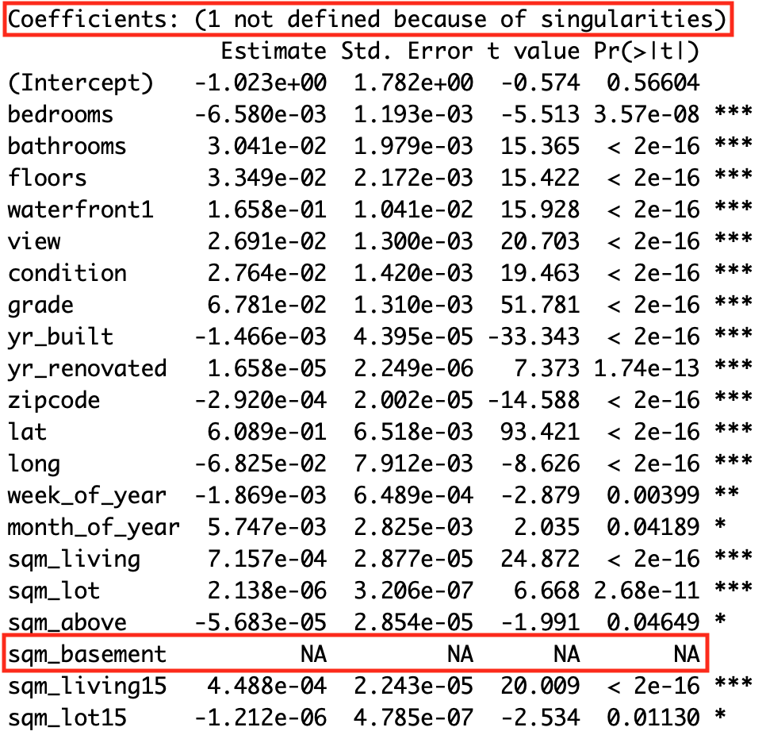

```{r setup, include=FALSE}
set.seed(1234)
#install.packages("kableExtra")
#install.packages("jpeg")
#install.packages("png")
#install.packages("kable")
#install.packages("gridExtra")
library(lubridate)
library(gridExtra)
library(MASS)
library(png)
library(jpeg)
library(tidyverse)
library(knitr)
library(car)
library(faraway)
library(broom)
knitr::opts_chunk$set(echo = FALSE, cache=TRUE, warning=FALSE)
library(kableExtra)
options("kableExtra.html.bsTable" = T)
options(scipen=999)

raw_data <- readRDS("raw_data.rds")
full_data <- readRDS("full_data.rds")
full_data_woo <- readRDS("full_data_woo.rds")

B <- 100
k <- 10
```

## The dataset

- Houses sold between May 2014 and May 2015
- Observations: **`r nrow(raw_data)`**
- Variables: **`r ncol(raw_data)`**

```{r fig.align = "center"}
knitr::include_graphics("King_county_map.PNG")
```


## Variables

```{r echo=FALSE}
matrix(colnames(raw_data), ncol = 3) %>%
  kable() %>%
  kable_styling(bootstrap_options = c("striped", "hover"))
```

## Response variable numeric inspection

```{r include=FALSE}
Y_col = raw_data$price
```

* Min: **`r min(Y_col)`**
* 1st quartile: **`r quantile(Y_col, 0.25)`**
* Median: **`r median(Y_col)`**
* 3rd quartile: **`r quantile(Y_col, 0.75)`**
* Max: **`r max(Y_col)`**
* Mean (average): **`r round(mean(Y_col), 2)`**
* Standard deviatiion: **`r round(sd(Y_col), 2)`**

## Response variable visual inspection

```{r echo=FALSE, fig.align = "center", fig.width=10.3, fig.height=5.5}
par(mfrow = c(1,2))
truehist(raw_data$price,
         xlab = "price")
a <- qqPlot(raw_data$price,
            xlab = "quantiles",
            ylab = "")
```


## Response variable transformation

```{r echo=FALSE, fig.align = "center", fig.width=10.3, fig.height=5.5}
par(mfrow = c(1,2))
truehist(log10(raw_data$price),
         xlab = "price")
a <- qqPlot(log10(raw_data$price),
            xlab = "quantiles",
            ylab = "")
```


## How are we going to select the models?

* Problem: p-value and multiple testing
* Alternative criteria:
    + $AIC$
    + $BIC$
    + $R^2_{adj.}$
    + $RMSE$

## Preliminary data formating

**Changes**:

  - **square feet** into **square meters**
  - waterfront and renovated into a **factor** variable
  - **log10** of price (response variable)
  - split date into **week** and **month** of the year
  - split dataset into **two parts**, 80% and 20% (more on this later)


```{r}
data_wo_new_vars <- full_data %>%
  select(-wasViewed, -renovated, -mean_price_zip)

model_1 <- lm(price ~ ., data = data_wo_new_vars)
```

## First model {.flexbox .vcenter}

<div class="columns-2">

```{r}

```

```{r include=FALSE}
a <- round(summary(model_1)$adj.r.squared, 4)
b <- round(AIC(model_1), 4)
c <- round(BIC(model_1), 4)
```


**Criteria:**

  - $R^2_{adj}$: `r a`
  - $AIC$: `r b`
  - $BIC$: `r c`
</div>

## Outliers

```{r echo=FALSE, fig.align = "center", fig.width=10.3, fig.height=5.5}
par(mfrow = c(1,2))
plot(model_1, which=5)
plot(model_1, which=4)

#head(sort(cooks.distance(model_1), decreasing = T), 4)
```

## Post outlier removal comparison

* Dropping extreme outlier improves the model

```{r warning=FALSE}
cross_val <- function(data, B = 100, k = 10){
  n <- nrow(data)
  folds <- sample(rep(c(1:k), length.out = nrow(data)))
  results <- matrix(0, nrow = k, ncol = B)
  for (b in 1:B){
    for (i in 1:k) {
      training <- data[folds != i,]
      test <- data[folds == i,]

      lmo <- lm(data = training, price ~ .)
      predict <- predict(lmo, test)
    
      results[i,b] <- sum((10^test$price - 10^predict)^2)/length(test$price)
    }
  }
  m_rmse <- mean(sqrt(results))
  sd_rmse <- sd(sqrt(results))
  l <- list(distr = sqrt(results), m_rmse = m_rmse, sd_rmse = sd_rmse)
  return(l)
}

intermediate_1 <- full_data_woo %>%
  select(-wasViewed, -renovated, -mean_price_zip)

intermediate_2 <- data_wo_new_vars

model_2 <- intermediate_1 %>%
  lm(data = . , price ~ .)

cv_2 <- cross_val(intermediate_1)
cv_1 <- cross_val(intermediate_2)

p_value_1 <- tidy(t.test(cv_1$distr, cv_2$distr, var.equal = F)) %>% 
  select(p.value) %>% 
  unlist() %>% 
  formatC(format = "e") %>% 
  rbind(" ",.)

Mean_RMSE <- rbind(cv_1$m_rmse, cv_2$m_rmse)
SD_RMSE <- rbind(cv_1$sd_rmse, cv_2$sd_rmse)

cbind(AIC(model_1, model_2), Mean_RMSE, SD_RMSE, p_value_1) %>%
  kable() %>%
  kable_styling()
```

## Creating new variables

* Average price by zipcode
    + sampling 20% of the data
    + computing average price by zipcode
    + adding computed averages to remaining 80%

* Factorize:
    + view variable into viewed or not viewed
    + year_renovated into was renovated at all or not

* Still keeping the untransformed data

```{r warning=FALSE}
intermediate_3 <- full_data_woo

model_3 <- lm(price ~ ., data = intermediate_3)

cv_3 <- cross_val(intermediate_3)

p_value_2 <- tidy(t.test(cv_2$distr, cv_3$distr, var.equal = F)) %>% 
  select(p.value) %>% 
  unlist() %>% 
  formatC(format = "e") %>% 
  rbind(" ",.)

Mean_RMSE <- rbind(cv_2$m_rmse, cv_3$m_rmse)
SD_RMSE <- rbind(cv_2$sd_rmse, cv_3$sd_rmse)

cbind(AIC(model_2, model_3), Mean_RMSE, SD_RMSE, p_value_2) %>%
  kable() %>%
  kable_styling()
```

## Visual correlation inspections (Part I)

```{r echo=FALSE, fig.align = "center", fig.width=10.3, fig.height=5.5}
par(mfrow = c(1,2))

plot(x = full_data$week_of_year, y = log10(full_data$price), main = "Week of Year  vs.  Price", ylab = "", xlab = "")
plot(x = full_data$yr_built, y = log10(full_data$price), main = "Year Built  vs.  Price", ylab = "", xlab = "")

```

## Visual correlation inspections (Part II)

```{r echo=FALSE, fig.align = "center", fig.width=10.3, fig.height=5.5}
par(mfrow = c(1,2))

plot(x = full_data$floors, y = log10(full_data$price), main = "Floors  vs.  Price", ylab = "", xlab = "")
plot(x = full_data$lat, y = log10(full_data$price), main = "Latitude  vs.  Price", ylab = "", xlab = "")

```


## Visual correlation inspections (Part III)

```{r echo=FALSE, fig.align = "center", fig.width=10.3, fig.height=5.5}
par(mfrow = c(1,2))

plot(x = full_data$sqm_living, y = log10(full_data$price), main = "Sqm. Living  vs.  Price", ylab = "", xlab = "")
plot(x = full_data$mean_price_zip, y = log10(full_data$price), main = "Mean Price Zip  vs.  Price", ylab = "", xlab = "")


```


## Variable preselection

**Correlation analysis:**

```{r echo=FALSE, warning=FALSE}
corrs <- full_data %>%
  dplyr::select(-waterfront, -renovated, - wasViewed) %>%
  cor(.) %>%
  .[,1] %>%
  abs(.) %>%
  sort(.) %>%
  as.matrix(., nrow(length(.)))


good_corr <- corrs %>%
  rownames(.) %>%
  .[10:length(.)]

corrs_names = rownames(corrs)
corrs = cbind(corrs_names, round(corrs, 4))
rownames(corrs) = NULL
colnames(corrs) = NULL

cbind(corrs[1:7,], corrs[8:14,], corrs[15:21,]) %>%
  kable() %>%
  kable_styling(bootstrap_options = c("striped", "hover"))
```
## Variable preselection 

* Hypothesis:
    + We observe a big jump in correlation from 0.107 to 0.314
    + Dropping all variables below 0.314 might decrease prediction error


```{r warning=FALSE}

intermediate_4 <- full_data_woo %>%
  dplyr::select(one_of(good_corr), renovated, waterfront, wasViewed)

model_4 <- lm(price ~ ., data = intermediate_4)

cv_4 <- cross_val(intermediate_4)

Mean_RMSE <- rbind(cv_3$m_rmse, cv_4$m_rmse)
SD_RMSE <- rbind(cv_3$sd_rmse, cv_4$sd_rmse)

p_value_3 <- tidy(t.test(cv_3$distr, cv_4$distr, var.equal = F)) %>% 
  select(p.value) %>% 
  unlist() %>% 
  formatC(format = "e") %>% 
  rbind(NA,.)

cbind(AIC(model_3, model_4), Mean_RMSE, SD_RMSE, p_value_3) %>%
  kable() %>%
  kable_styling()
```


## Variable selection

* **sqm_living** is a linear combination of **sqm_basement** and **sqm_above**.
* Deleting variables because of redundancy
    + choosing the best transformations first
    + then drop the variable of the worse perfoming model

```{r}
intermediate_5 <- full_data_woo %>%
  mutate(
    sqm_above = sqrt(sqm_above),
    sqm_basement = sqrt(sqm_basement)
  ) %>%
  dplyr::select(-sqm_living) 

model_5 <- lm(data = intermediate_5, price ~ .)

intermediate_6 <- full_data_woo %>%
  mutate(
    sqm_living = sqrt(sqm_living)
  ) %>%
  dplyr::select(-sqm_above, -sqm_basement) 

model_6 <- lm(data = intermediate_6, price ~ .)

s_model_5 <- summary(model_5)
s_model_6 <- summary(model_6)

cv_5 <- cross_val(intermediate_5)
cv_6 <- cross_val(intermediate_6)

p_value_4 <- tidy(t.test(cv_5$distr, cv_6$distr, var.equal = F)) %>% 
  select(p.value) %>% 
  unlist()

row_names <- c("Model with sqm_above & sqm_basement", "Model with sqm_living")
col_names <- c("R^2 adjust.", "AIC", "BIC", "Mean_RMSE", "SD_RMSE", "P-value")
a <- matrix(c(round(s_model_5$adj.r.squared, 4),
              round(AIC(model_5), 4),
              round(BIC(model_5), 4),
              round(cv_5$m_rmse, 4),
              round(cv_5$sd_rmse, 4),
              NA,
              round(s_model_6$adj.r.squared, 4),
              round(AIC(model_6), 4),
              round(BIC(model_6), 4),
              round(cv_6$m_rmse, 4),
              round(cv_6$sd_rmse, 4),
              round(p_value_4, 4)),
            ncol = 6,
            byrow = T,
            dimnames = list(row_names, col_names))


a %>%
  kable() %>%
  kable_styling(bootstrap_options = c("striped", "hover"))
```


## Variable Transformation

```{r include=FALSE}
transformed_data <- full_data_woo %>%
  select(-sqm_living) %>%
  mutate(
    sqm_above = sqrt(sqm_above),
    sqm_basement = sqrt(sqm_basement),
    floors = log10(floors),
    bathrooms = bathrooms^(1/5),
    sqm_living15 = log10(sqm_living15),
    mean_price_zip = mean_price_zip,
    grade = log10(grade),
    condition = log10(condition),
    yr_built = log10(yr_built),
    lat = log10(lat),
    week_of_year = log10(week_of_year),
    month_of_year = log10(month_of_year),
    sqm_lot15 = log10(sqm_lot15)
  )
```

- **log10:** floors, sqm_living15, grade, condition, yr_built, lat, week_of_year, month_of_year, sqm_lot15
- **sqrt:** sqm_above, sqm_basement
- **power of 1/5**: bathrooms

```{r}
model_7 <- transformed_data %>%
  lm(data = ., price ~ .)

cv_7 <- cross_val(transformed_data)

p_value_4 <- tidy(t.test(cv_5$distr, cv_7$distr, var.equal = F)) %>% 
  select(p.value) %>% 
  unlist() %>% 
  round(digits = 4) %>% 
  rbind(" ", " ", .)

Mean_RMSE <- rbind(cv_1$m_rmse, cv_5$m_rmse, cv_7$m_rmse)
SD_RMSE <- rbind(cv_1$sd_rmse, cv_5$sd_rmse, cv_7$sd_rmse)

cbind(AIC(model_1, model_5, model_7), Mean_RMSE, SD_RMSE, p_value_4) %>%
  kable() %>%
  kable_styling()
```


